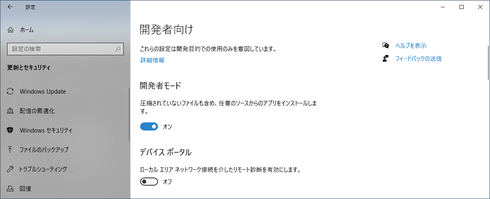
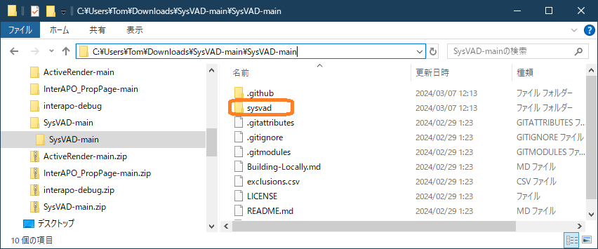
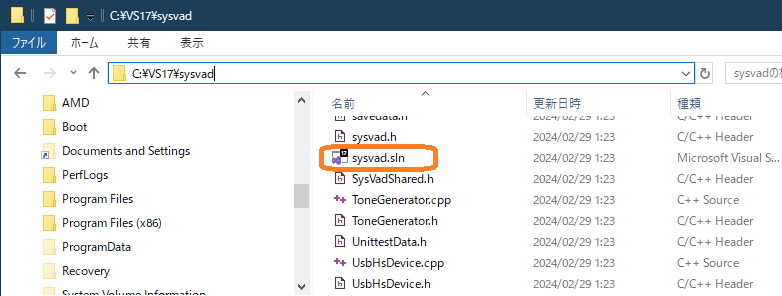
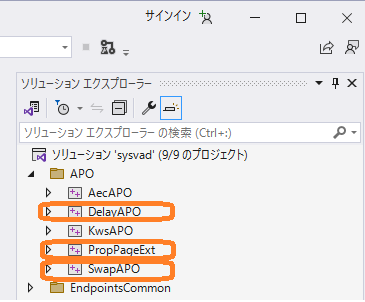
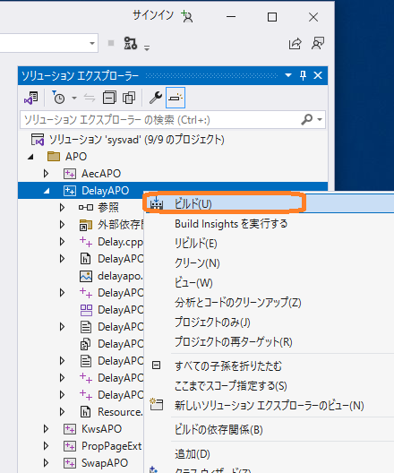
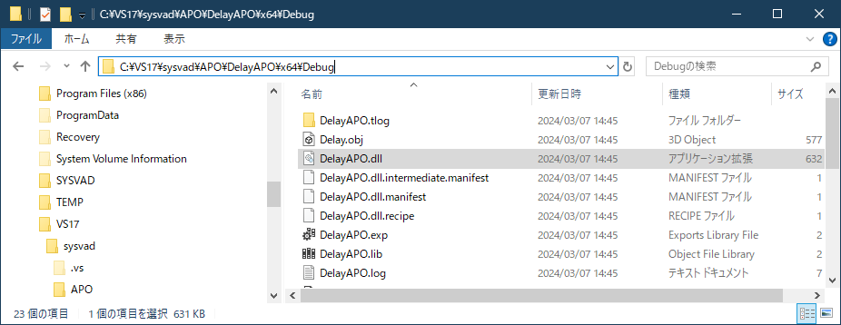
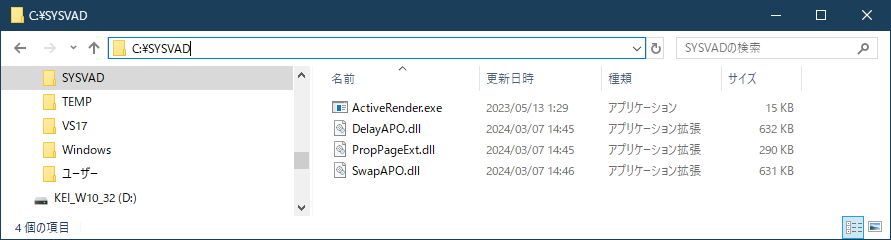
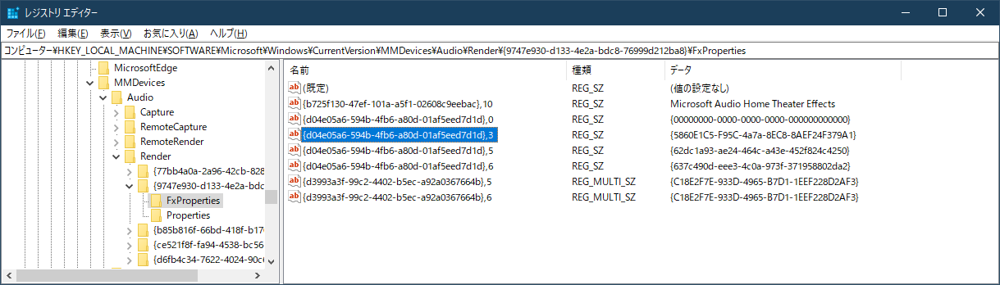

# Training.md

Windows APO Development Links / Training.md

## Windows 11 APO 開発セミナー 演習 補足情報

### Windows の開発者向け 設定



### 3. サンプルコードAPO 演習

#### SYSVAD フォルダーのコピー（コピー元フォルダー）



#### sysvad.sln ソリューションファイル（Visual Studio で開く）



#### ビルド対象プロジェクト（DelayAPO, PropPageExt, SwapAPO）



#### ビルドのプルダウンメニュー（ソリューション エクスプローラー）



#### ビルドしたオブジェクト（dll）の場所

DelayAPO.dll, PropPageExt.dll, SwapAPO.dll のコピーが必要。



#### コピー先： C:\SYSVAD フォルダー




#### OCXを登録

```sh
Regsvr32 DelayAPO.dll
Regsvr32 SwapAPO.dll
Regsvr32 PropPageExt.dll
```
<br/>

#### 操作前のレジストリ


<br/>

#### レジストリの操作（APO 登録用）

APOを登録するためのレジストリを編集します。 RegEditを開き、ActiveRenderコマンドで確認しておいた、 HKEY_LOCAL_MACHINE\SOFTWARE\Microsoft\Windows\CurrentVersion\MMDevices\Audio 以下のデバイスGUID以下の「FxProperties」を参照して次の操作します。

**古い値の削除**

以下のプロジェクトキーがある場合は、全て削除します。

    {d04e05a6-594b-4fb6-a80d-01af5eed7d1d},3
    {d04e05a6-594b-4fb6-a80d-01af5eed7d1d},5
    {d04e05a6-594b-4fb6-a80d-01af5eed7d1d},6
    {d04e05a6-594b-4fb6-a80d-01af5eed7d1d},7

**新しいAPO値登録**

次の操作でビルドした新しいAPOのCLSIDを設定します。 CLSIDのGUIDは、ビルドした各ソースコード中のIDLファイル等に記述されているので、それを探してコピーすることが可能です。

    {d04e05a6-594b-4fb6-a80d-01af5eed7d1d},3

に

    {19166F23-5F08-47F9-BB57-9F57A977D88E}

を設定します。（CPL: コントロールパネルのダイアログ）
無い場合は、値をREG_SZ型で作成します。

    {d04e05a6-594b-4fb6-a80d-01af5eed7d1d},13

に

    {B48DEA3F-D962-425a-8D9A-9A5BB37A9904}
    {77802b45-a5a0-455a-8204-3dba30eee7b4}

を設定します。無い場合は、値をREG_MULTI_SZ型で作成します。


    {d04e05a6-594b-4fb6-a80d-01af5eed7d1d},14

に

    {06687E71-F043-403A-BF49-CB591BA6E103}
    {b6c7032b-1f17-4cc6-bcdb-fd96deabc8a9}

を設定します。無い場合は、値をREG_MULTI_SZ型で作成します。

REG_MULTI_SZ値は改行コードで区切ります。
<br/>

### 6. WPP トレースによるデバッグ 演習

#### レジストリの操作（APO 登録用）

##### 古い値の削除

    {d04e05a6-594b-4fb6-a80d-01af5eed7d1d},'X'

##### InterAPO Class Interface値登録

    {d04e05a6-594b-4fb6-a80d-01af5eed7d1d},3

に

    {A0AA1C9B-B09F-4AE4-90E0-77C8EDD977B2}

をREG_SZ型で設定

    {d04e05a6-594b-4fb6-a80d-01af5eed7d1d},5

に

    {01A74FEF-9251-498B-9668-4FDF50261465}

をREG_SZ型で設定

    {d04e05a6-594b-4fb6-a80d-01af5eed7d1d},6

に

    {2CB5CD90-6D7B-4ABC-AB85-8CB066C849A2}

をREG_SZ型で設定


#### 作成するレジストリのプロパティキーと値（動作パラメーター）

    {A44531EF-5377-4944-AE15-53789A9629C7},6
に 1

    {A44531EF-5377-4944-AE15-53789A9629C7},7
に 0

    {0F2212E5-3612-459C-BE43-1FF0E576786A},0
に 10

    {0F2212E5-3612-459C-BE43-1FF0E576786A},1
に 0

    {0F2212E5-3612-459C-BE43-1FF0E576786A},2
に 0

    {0F2212E5-3612-459C-BE43-1FF0E576786A},3
に 0

    {0F2212E5-3612-459C-BE43-1FF0E576786A},4
に 0

    {0F2212E5-3612-459C-BE43-1FF0E576786A},5
に 0

    {0F2212E5-3612-459C-BE43-1FF0E576786A},6
に 0

    {0F2212E5-3612-459C-BE43-1FF0E576786A},7
に 0
